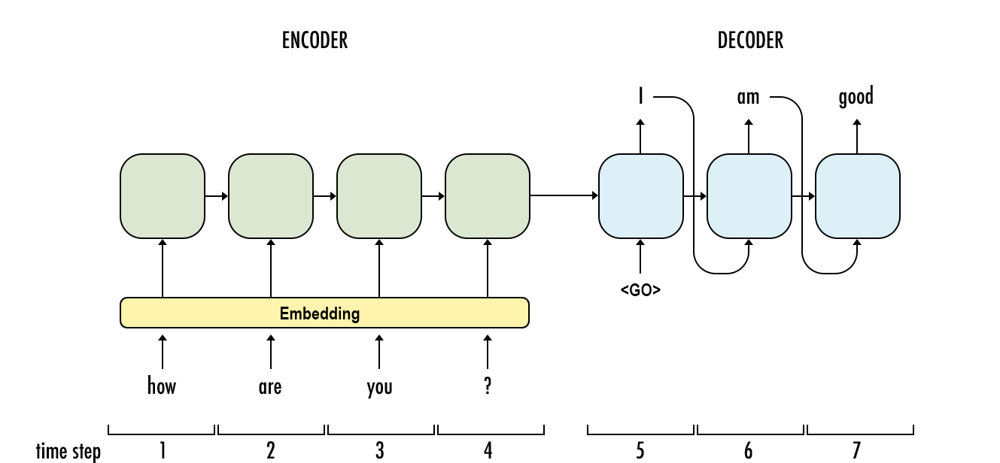

# Introduction To Deep Learning

## What is Deep Learning?

* Deep Learning is the secret sauce behind everything from "Self Driving Cars (having Computer vision - Vehicle detection and lane line detection, etc)" to language translation and even generated arts."

* Deep Learning made impossible thing possible like science fiction like for example : "Helping Faces" an application developed in india that uses facial recognition to find missing children reuniting them with their families.

* Deep Learning is saving real human life:- IBM is using browse millions of genetic profiles in a way no single human could classify genetic disorders and patients accurately and, Amazon Alexa which uses deep learning to recognize interpret and act on human speech.

let us see some networks of deep learning. We will understand further in journey how these networks implemented in deep learning and how we can use them. Now let's see only it's structural part images.

## Neural Networks


## Convolutional Networks
Convolutional networks have achieved state of the art results in computer vision. These types of networks can detect and identify objects in images.


## Recurrent Neural Networks
Recurrent Neural Networks (RNNs) — a type of network architecture particularly well suited to data that forms sequences like text, music, and time series data. 


Word2Vec model, a network that can learn about semantic relationships between words. These are used to increase the efficiency of networks when you're processing text.


Embeddings and an RNN use to predict the sentiment of movie reviews, it is an example of common tasks in Natural language processing.



## Generative Adversarial Networks
Generative adversarial networks (GANs) are one of the newest and most exciting deep learning architectures, showing incredible capacity for understanding real-world data. The networks can be used for generating images such as the CycleGAN project.


## Deep Reinforcement Learning

Deep reinforcement learning has been in the center of some of the most recent advances in artificial intelligence. For example, it was widely used in the construction of AlphaGo by DeepMind. Deep neural networks use to design agents that can "learn" to take actions in a simulated environment.


### [Markdown cheatsheet](https://github.com/adam-p/markdown-here/wiki/Markdown-Cheatsheet)

### [Keyboard Shortcut](./keyboard-shortcuts.ipynb)

## Magic Keywords :
Magic keywords are special commands you can run in cells that let you control the notebook itself or perform system calls such as changing directories. For example, you can set up matplotlib to work interactively in the notebook with ```%matplotlib```.

Magic commands are preceded with one or two percent signs (```%``` or ```%%```) for line magics and cell magics, respectively. Line magics apply only to the line the magic command is written on, while cell magics apply to the whole cell.

> NOTE: These magic keywords are specific to the normal Python kernel. If you are using other kernels, these most likely won't work.

### **Timing code:** You can use the ```%timeit``` magic command to time how long it takes for a function to run.


If you want to time how long it takes for a whole cell to run, you’d use ```%%timeit``` like so:


### **Embedding visualizations :** 
This is most useful when you’re using matplotlib or other plotting packages to create visualizations. You can use %matplotlib to set up matplotlib for interactive use in the notebook. To render figures directly in the notebook, you should use the inline backend with the command ```%matplotlib inline```.

> Tip: On higher resolution screens such as Retina displays, the default images in notebooks can look blurry. Use ```%config InlineBackend```.figure_format = 'retina' after ```%matplotlib inline``` to render higher resolution images.


### **Debugging :** With the Python kernel, you can turn on the interactive debugger using the magic command ```%pdb```. 


 I tried to sum up a string which gives an error. The debugger raises the error and provides a prompt for inspecting your code.
 To quit the debugger, simply enter q in the prompt.